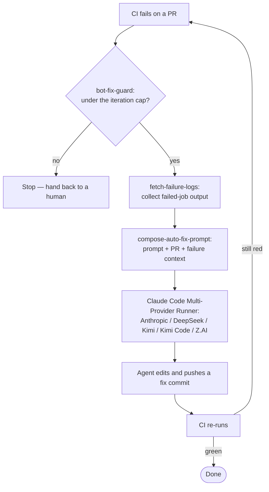

# agent-ci-actions

Run **Claude Code in CI across providers** — Anthropic, **DeepSeek**, **Kimi (Moonshot)**,
**Kimi Code**, **Z.AI (GLM)**, or any Anthropic-compatible endpoint — and wire up
**self-healing auto-fix** loops. Works with both pay-per-token API keys and coding-plan
subscriptions. Domain-agnostic: no project-specific tool allowlists are baked in; you
supply them.

De-duplicated from several private repositories into one maintained source of truth.

## Why

- **Provider choice.** One token swap runs the same agent on Anthropic, DeepSeek, Kimi,
  Kimi Code, or Z.AI — pick by cost, context window, or availability without rewriting
  workflows, and pay by token or against a coding-plan subscription.
- **Auto-fix.** Turn a red CI run into an agent that reads the failure, pushes a fix,
  and lets CI re-run — bounded by an iteration cap so it never loops forever.
- **No lock-in to one project.** Tool allowlists ("presets") are caller-supplied JSON,
  so the same actions serve a Lean repo, a TypeScript repo, or anything else.

## Actions

| Action | Reference | What it does |
| --- | --- | --- |
| **Claude Code Multi-Provider Runner** | `LionSR/agent-ci-actions@v1` | Run Claude Code against Anthropic / DeepSeek / Kimi / Kimi Code / Z.AI / any compatible provider; resolve model by tier; apply a caller-supplied tool preset. |
| **Compose auto-fix prompt** | `LionSR/agent-ci-actions/compose-auto-fix-prompt@v1` | Load a prompt, append CI-failure + PR context, expose as one output. |
| **Auto-create PR for issue work** | `LionSR/agent-ci-actions/auto-create-issue-pr@v1` | Open a PR from a bot-pushed issue branch; optionally add an auto-fix label. |
| **Fetch failure logs** | `LionSR/agent-ci-actions/fetch-failure-logs@v1` | Download + sanitize failed-job logs from a workflow run. |
| **Fetch review comments** | `LionSR/agent-ci-actions/fetch-review-comments@v1` | Fetch unresolved PR review threads via GraphQL. |
| **Attach PR branch** | `LionSR/agent-ci-actions/attach-pr-branch@v1` | Resolve and check out a PR head branch. |
| **Bot-fix guard** | `LionSR/agent-ci-actions/bot-fix-guard@v1` | Count prior bot-fix commits to cap auto-fix loops. |

## Providers

The runner wraps [`anthropics/claude-code-action`](https://github.com/anthropics/claude-code-action)
and talks to any **Anthropic-compatible** API.

```yaml
# Anthropic (default)
- uses: LionSR/agent-ci-actions@v1
  with:
    provider: anthropic
    claude-oauth-token: ${{ secrets.CLAUDE_CODE_OAUTH_TOKEN }}
    model-tier: opus            # -> claude-opus-model (default claude-opus-4-8)
    prompt: 'Fix the failing build.'
```

```yaml
# DeepSeek (see https://api-docs.deepseek.com/quick_start/agent_integrations/claude_code/)
- uses: LionSR/agent-ci-actions@v1
  with:
    provider: deepseek
    deepseek-api-key: ${{ secrets.DEEPSEEK_API_KEY }}
    # defaults: base https://api.deepseek.com/anthropic,
    # model deepseek-v4-pro[1m]; haiku/subagent → deepseek-v4-flash
    prompt: 'Fix the failing build.'
```

```yaml
# Kimi / Moonshot (Anthropic-compatible endpoint; see
# https://platform.kimi.ai/docs/guide/claude-code-kimi)
- uses: LionSR/agent-ci-actions@v1
  with:
    provider: kimi              # moonshot is accepted as an alias
    kimi-api-key: ${{ secrets.KIMI_API_KEY }}
    # defaults: base https://api.moonshot.ai/anthropic, model kimi-k3[1m]
    prompt: 'Fix the failing build.'
```

```yaml
# Kimi Code subscription (see
# https://www.kimi.com/code/docs/en/third-party-tools/claude-code)
- uses: LionSR/agent-ci-actions@v1
  with:
    provider: kimi-code         # kimicode / kimi_code / kimi-coding are aliases
    kimi-code-api-key: ${{ secrets.KIMI_CODE_API_KEY }}
    # defaults: base https://api.kimi.com/coding/, model k3[1m]
    prompt: 'Fix the failing build.'
```

```yaml
# Z.AI / GLM Coding Plan (see https://docs.z.ai/devpack/tool/claude and
# https://docs.z.ai/devpack/latest-model)
- uses: LionSR/agent-ci-actions@v1
  with:
    provider: zai               # z.ai and glm are accepted as aliases
    zai-api-key: ${{ secrets.ZAI_API_KEY }}
    # defaults: base https://api.z.ai/api/anthropic,
    # opus/sonnet glm-5.2[1m], haiku/subagent glm-4.7
    prompt: 'Fix the failing build.'
```

```yaml
# Any other Anthropic-compatible endpoint via base-url override
- uses: LionSR/agent-ci-actions@v1
  with:
    provider: anthropic
    anthropic-base-url: https://example.compat/anthropic
    anthropic-api-key: ${{ secrets.COMPAT_API_KEY }}
    claude-opus-model: my-compat-model
    prompt: 'Fix the failing build.'
```

`model-tier` (`opus` / `sonnet`) picks between the opus- and sonnet-tier model inputs,
so one workflow can dial cost/quality per call. Tokens and model names also fall back to
the matching env vars (`CLAUDE_CODE_OAUTH_TOKEN`, `DEEPSEEK_API_KEY`, `KIMI_API_KEY` /
`MOONSHOT_API_KEY` / `ANTHROPIC_AUTH_TOKEN`, `KIMI_CODE_API_KEY`, `ZAI_API_KEY` /
`GLM_API_KEY`, `CLAUDE_OPUS_MODEL`, `KIMI_OPUS_MODEL`, `ZAI_OPUS_MODEL`, …).

For every non-Anthropic provider the action fills all `ANTHROPIC_DEFAULT_*_MODEL` tiers
plus `CLAUDE_CODE_SUBAGENT_MODEL`, `CLAUDE_CODE_AUTO_COMPACT_WINDOW`, and
`CLAUDE_CODE_EFFORT_LEVEL`, so background and sub-agent calls never fall back to
Anthropic model names.

### API keys vs. coding plans

| Provider | Key | Endpoint | Auth |
| --- | --- | --- | --- |
| `kimi` | platform.kimi.ai (pay-per-token) | `https://api.moonshot.ai/anthropic` | `ANTHROPIC_AUTH_TOKEN` |
| `kimi-code` | Kimi Code Console (subscription) | `https://api.kimi.com/coding/` | `ANTHROPIC_API_KEY` |
| `zai` | Open Platform key **or** GLM Coding Plan | `https://api.z.ai/api/anthropic` | `ANTHROPIC_AUTH_TOKEN` |
| `deepseek` | platform key (pay-per-token only) | `https://api.deepseek.com/anthropic` | `ANTHROPIC_AUTH_TOKEN` |

Moonshot runs two independent platforms and **their keys are not interchangeable** — a
`platform.kimi.ai` key returns 401 against the subscription endpoint and vice versa, so
pick the provider that matches where the key was issued.

Z.AI needs no such split: both key types use the same endpoint and auth. The defaults are
already Coding Plan–safe, since that plan only allows GLM-5.2, GLM-5-Turbo, and GLM-4.7.

### DeepSeek models (Claude Code)

IDs from the [DeepSeek Claude Code guide](https://api-docs.deepseek.com/quick_start/agent_integrations/claude_code/)
and [Models & Pricing](https://api-docs.deepseek.com/quick_start/pricing) (both have 1M context):

| Role | Model | Notes |
| --- | --- | --- |
| Main / opus / sonnet default | `deepseek-v4-pro[1m]` | **Default** for `--model` and opus/sonnet tiers |
| Haiku / sub-agent | `deepseek-v4-flash` | Cheaper; set via `deepseek-flash-model` |

Claude Desktop/Code also map `claude-opus*` → pro and `claude-sonnet*` / `claude-haiku*` → flash when you only change base URL + key.

```yaml
# Cheaper CI: run the sonnet tier on flash
- uses: LionSR/agent-ci-actions@v1
  with:
    provider: deepseek
    deepseek-api-key: ${{ secrets.DEEPSEEK_API_KEY }}
    model-tier: sonnet
    deepseek-sonnet-model: deepseek-v4-flash
    prompt: 'Fix the failing build.'
```

### Kimi platform models (Claude Code)

IDs for the pay-per-token endpoint — see [Model List](https://platform.kimi.ai/docs/models)
and [Use Kimi in Claude Code](https://platform.kimi.ai/docs/guide/claude-code-kimi):

| Model | Context | Notes |
| --- | --- | --- |
| `kimi-k3[1m]` | 1M | **Default.** Flagship; Claude Code spelling of `kimi-k3`. |
| `kimi-k2.7-code` | 256K | Dedicated coding model; thinking always on. |
| `kimi-k2.7-code-highspeed` | 256K | Same as `kimi-k2.7-code`, ~5–6× faster output. |
| `kimi-k2.6` | 256K | Thinking optional; good for latency-sensitive tasks. |

Compact window is set automatically: `1048576` for `kimi-k3*`, `262144` for `k2.7` / `k2.6`.
Override with `kimi-opus-model` / `kimi-sonnet-model` (or `KIMI_OPUS_MODEL` / `KIMI_SONNET_MODEL`).

**Deprecated — do not use:** `kimi-k2-0905-preview`, other `kimi-k2-*-preview` /
`kimi-k2-thinking*` IDs (sunset May 25, 2026). `kimi-k2.5` and `moonshot-v1*` are
being removed for new accounts.

```yaml
# Cheaper/faster coding CI on the sonnet tier
- uses: LionSR/agent-ci-actions@v1
  with:
    provider: kimi
    kimi-api-key: ${{ secrets.KIMI_API_KEY }}
    model-tier: sonnet
    kimi-sonnet-model: kimi-k2.7-code
    prompt: 'Fix the failing build.'
```

### Kimi Code models (Claude Code)

IDs for the subscription endpoint — see the
[Kimi Code Claude Code guide](https://www.kimi.com/code/docs/en/third-party-tools/claude-code)
and the [membership guide](https://www.kimi.com/help/kimi-code/membership-guide):

| Model | Context | Notes |
| --- | --- | --- |
| `k3[1m]` | 1M | **Default.** |
| `k3-256k` | 256K | Same model, smaller window. |
| `kimi-for-coding` | 256K | Version-stable ID; auto-maps to the current model. |
| `kimi-for-coding-highspeed` | 256K | ~5–6× faster output, ~3× credits; needs Allegretto or above. |

Compact window follows the model ID: `1048576` for a `[1m]` ID, `262144` otherwise
(undersizing only compacts early, whereas oversizing overflows the API).
`CLAUDE_CODE_MAX_CONTEXT_TOKENS` is set to the same value and
`CLAUDE_CODE_EFFORT_LEVEL` to `high`, per the guide. Override any of them with
`kimi-code-opus-model` / `kimi-code-sonnet-model` or the matching env vars.

```yaml
# Version-stable ID with the high-speed tier
- uses: LionSR/agent-ci-actions@v1
  with:
    provider: kimi-code
    kimi-code-api-key: ${{ secrets.KIMI_CODE_API_KEY }}
    kimi-code-opus-model: kimi-for-coding-highspeed
    kimi-code-sonnet-model: kimi-for-coding
    prompt: 'Fix the failing build.'
```

### Z.AI / GLM models (Claude Code)

IDs from the [Z.AI Claude Code guide](https://docs.z.ai/devpack/tool/claude) and
[How to Switch Models](https://docs.z.ai/devpack/latest-model). GLM Coding Plan
calls are limited to **GLM-5.2**, **GLM-5-Turbo**, and **GLM-4.7**
([FAQ](https://docs.z.ai/devpack/faq)):

| Role | Model | Notes |
| --- | --- | --- |
| Main / opus / sonnet default | `glm-5.2[1m]` | **Default.** Latest flagship with 1M context (`[1m]` suffix). |
| Haiku / sub-agent | `glm-4.7` | **Default** for background tiers (Coding Plan–safe). |
| Faster / cheaper main | `glm-5-turbo` or `glm-4.7` | Set via `zai-opus-model` / `zai-sonnet-model`. |

Also sets `API_TIMEOUT_MS=3000000`, `CLAUDE_CODE_AUTO_COMPACT_WINDOW=1000000`
(Z.AI’s documented value), and `CLAUDE_CODE_DISABLE_NONESSENTIAL_TRAFFIC=1`.

```yaml
# Pin everything to glm-4.7
- uses: LionSR/agent-ci-actions@v1
  with:
    provider: zai
    zai-api-key: ${{ secrets.ZAI_API_KEY }}
    zai-opus-model: glm-4.7
    zai-sonnet-model: glm-4.7
    prompt: 'Fix the failing build.'
```

## Tool presets are caller-supplied

The action ships **no** tool allowlists. Keep your presets in a checked-in JSON file and
point the action at it:

```jsonc
// .github/allowed-tools.json
{
  "auto-fix":  "Edit,Write,Read,Glob,Grep,Bash(make *),Bash(git add *),Bash(git commit *),mcp__github__*",
  "review":    "Read,Glob,Grep,Bash(gh pr diff *),mcp__github__*"
}
```

```yaml
- uses: LionSR/agent-ci-actions@v1
  with:
    allowed_tools_preset: auto-fix
    allowed_tools_preset_map_file: .github/allowed-tools.json
```

Resolution precedence: explicit `allowed_tools` → preset looked up in
`allowed_tools_preset_map` (inline JSON) or `allowed_tools_preset_map_file` →
`CLAUDE_ALLOWED_TOOLS` env → empty. An unknown preset against a non-empty map is a hard error.

## Auto-fix loop

The supporting actions compose a bounded self-healing loop: a failed CI run drives an
agent that reads the failure, pushes a fix, and lets CI re-run — capped by `bot-fix-guard`.



`bot-fix-guard` counts prior bot-fix commits so the loop is bounded; `fetch-failure-logs`
sanitizes the logs (treat them as untrusted data); `compose-auto-fix-prompt` folds the
failure context into the prompt; the runner executes the fix on your chosen provider.

## Versioning

Pin `@v1` to track `v1.x`, or a specific tag for strict reproducibility.

## License

[MIT](LICENSE).
